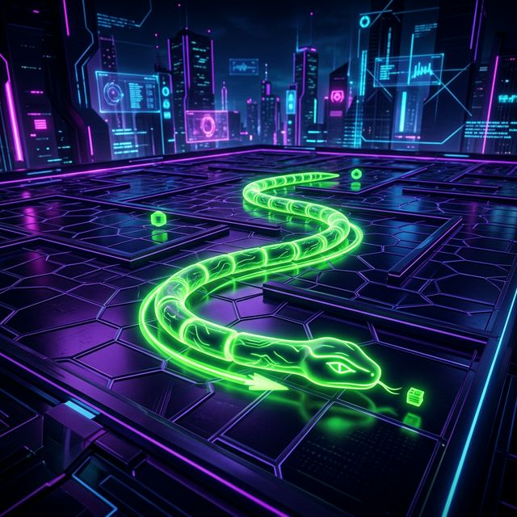

# 🐍 Snake Game | Neon Edition



A modern, high-fidelity take on the classic arcade game, built with a striking **Neon Aesthetic** and smooth gameplay. This project transforms the traditional Snake experience into a visually stunning digital landscape.

---

## ✨ Features

- **Neon Design System**: Premium visual style with glowing elements, custom typography, and dynamic animations.
- **Persistent High Score**: Real-time high score tracking saved locally using `localStorage`.
- **Immersive Soundscapes**: Dynamic audio feedback for moves, food consumption, and game over states.
- **Fluid Mechanics**: Optimized game loop with `requestAnimationFrame` for a smooth responsive feel.
- **Modern UI**: Futuristic dashboard with neon glow-effects and grid-based game board.

## 🕹️ How to Play

1. **Launch**: Open `index.html` in your favorite modern browser.
2. **Start**: Press any **Arrow Key** to initialize the game and start the background music.
3. **Controls**: Use the **Arrow Keys** (Up, Down, Left, Right) to navigate the snake.
4. **Objective**: Eat the glowing food nodes to grow and increase your score.
5. **Rules**: Avoid hitting the walls or your own tail. The game speed remains consistent for a classic challenge.

## 🛠️ Built With

- **HTML5**: Semantic structure and game container.
- **CSS3 (Custom Props)**: Advanced styling with gradients, glow effects, and responsive grid layouts.
- **Vanilla JavaScript**: Core game engine, collision detection, and state management.
- **Google Fonts**: [Orbitron](https://fonts.google.com/specimen/Orbitron) & [Share Tech Mono](https://fonts.google.com/specimen/Share+Tech+Mono) for that cyberpunk vibe.

## 📁 Project Structure

```text
├── assets/         # Sound effects and visual assets
├── index.html      # Main entry point
├── scripts.js      # Game logic and engine
├── styles.css      # Design system and layout
└── readme.md       # Project documentation
```

